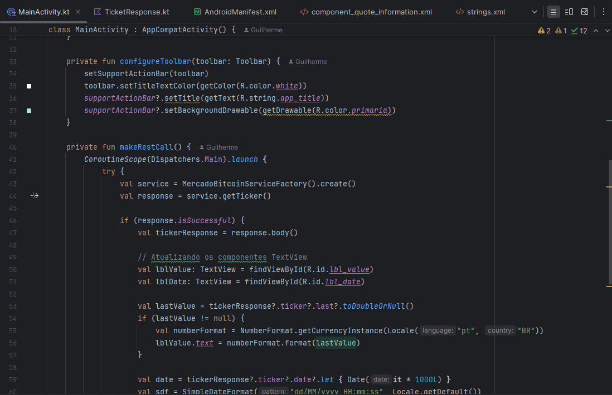

# AndroidCrypto sem XML
## Grupo

RM 87438 - Guilherme Luis Engel

RM 551406 - Gabriel Dias Santiago

---

## Código rodando:
Código iniciado

Fazendo a requisição da API

Código da chamada de API

---

## Explicando os arquivos kotlin:

### Service: 

A classe service representa uma regra de negócio ou a lógica principal da aplicação, executa tarefas em segundo plano e pode interagir com outros componentes da aplicação.

Como por exemplo, nessa service do projeto:

Aqui, ela faz uma requisição HTTP do método GET no caminho da API (api/BTC/ticker), onde na classe factory, contém a URL

---

### Factory:

Contém métodos que são usados para criar e retornar instâncias de outras classes

Aqui, ela define a URL padrão que será usada em todas as chamadas e já faz a conversão da API. E depois usa o retrofit para gerar a implementação da interface da service

---

### Main

A MainActivity.kt é a tela principal do app, ela está configurada para mostrar um titulo na toolbar, tem o botão de “atualizar“ para executar a chamada API e buscar o valor atual do Bitcoin, quando a resposta chega, ele atualiza nos campos de texto que necessita, e se der erro, mostra uma mensagem de erro

---

### Model

A Model é criada para representar dados de forma simples e concisa

Nessa model, representamos dados que ela vai receber da API do Mercado Bitcoin, “Ticker“ sendo o objeto que contém todas as informações enquanto “TicketResponse“ estrutura a resposta principal da API

